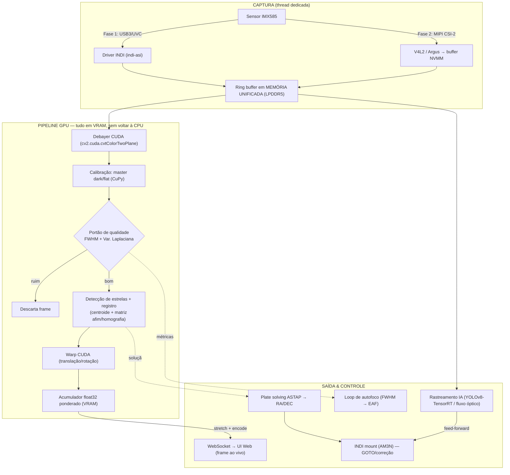

# 02 — Arquitetura de Dados & Software

Este documento responde ao **Entregável #1** do briefing: o fluxo lógico dos dados do sensor até a
saída de imagem, **minimizando cópias de memória Host (CPU) ↔ Device (GPU)**.

---

## 1. O princípio central: memória unificada (zero-copy)

Numa GPU discreta (PC de mesa), CPU e GPU têm memórias separadas e todo frame atravessa o barramento
PCIe (`cudaMemcpy`). **Na Jetson isso não existe:** CPU e GPU **compartilham fisicamente a mesma LPDDR5**.
Essa é a vantagem arquitetural que temos que explorar até o osso — é literalmente o que "minimiza gargalos
de cópia Host↔Device".

Regras de ouro do projeto:

1. **Alocar buffers acessíveis por CPU e GPU sem cópia.** Opções, da mais simples à mais controlada:
   - **CuPy Managed Memory** (`cupy.cuda.MemoryPool` com `malloc_managed`) — arrays visíveis aos dois lados.
   - **CUDA pinned/mapped host memory** (`cudaHostAllocMapped`) — ponteiro de device sobre buffer de host.
   - **NVMM / DMABUF** (caminho MIPI): o driver V4L2 entrega o frame já em buffer de GPU (`nvbufsurface`),
     debayer roda direto ali. **Zero cópia real.**
2. **Uma vez na GPU, o dado nunca volta para a CPU** até o resultado final (frame empilhado para a UI).
   Debayer, calibração, detecção de estrela, alinhamento, FWHM, integração — tudo em VRAM.
3. **Só volta para o host** o que precisa: o frame empilhado comprimido (JPEG/PNG) para o WebSocket, e
   escalares (métricas FWHM, contagem de estrelas) para as decisões de controle.

### Custo de cópia por caminho de câmera

| Caminho | Onde o frame nasce | Cópia até a GPU |
|---|---|---|
| **MIPI CSI (Fase 2)** | Buffer NVMM (memória de GPU) | **Zero** — debayer direto no DMABUF |
| **USB3 + INDI (Fase 1)** | RAM de host (driver USB) | 1 cópia host→unified (barata na Jetson; sem PCIe) |

Ou seja: mesmo o caminho USB da Fase 1 é barato aqui, porque a "cópia" é dentro da mesma DRAM física.
MIPI elimina até essa, e por isso é o upgrade de latência da Fase 2.

---

## 2. Fluxo de dados (sensor → VRAM → saída)



**Leitura do diagrama:** há **um único ponto de entrada na memória unificada** (o ring buffer). A partir
dali, o dado de imagem flui inteiramente na GPU. As setas pontilhadas são **escalares/decisões** (baratas),
não frames. Os laços de controle (autofoco, plate solve, mount, rastreamento) consomem métricas, não pixels
copiados de volta.

---

## 3. Orçamento de memória (por que 16GB)

Frame 4K = 3840×2160 = 8,29 Mpix.

| Buffer | Tamanho | Nota |
|---|---|---|
| RAW Bayer 16-bit (×N no ring) | 16,6 MB cada | N=8 → ~133 MB |
| Frame debayerizado RGB float32 | ~100 MB | trabalho |
| **Acumulador soma RGB float32** | ~100 MB | residente toda a sessão |
| **Mapa de pesos float32** | ~33 MB | residente |
| Master dark/flat | ~200 MB | residente |
| Buffers de warp/intermediários | ~300 MB | trabalho |
| Modelo YOLOv8-n TensorRT + workspace | ~300–600 MB | residente (rastreamento) |
| **Subtotal pipeline** | **~1,2–1,5 GB** | |

Cabe em 8GB, mas **com 16GB** roda *stacking* + rastreamento IA + plate solving simultâneos com folga,
o que os 8GB não sustentam sob carga. Daí a escolha do Orin NX 16GB para produção.

---

## 4. Stack de software (decisões)

| Camada | Escolha | Alternativa descartada | Motivo |
|---|---|---|---|
| Abstração de hardware | **INDI Server local** (mount, câmera, focalizador) | Drivers próprios | Ecossistema pronto, drivers maduros ARM64 |
| Orquestrador / autonomia | **Serviço próprio Python** (`pyindi-client`) | Ekos/KStars (desktop) | Queremos *appliance* headless com UX web, não desktop |
| Pré-processo GPU | **OpenCV-CUDA** (`cv2.cuda`) | OpenCV CPU | Debayer/warp/filtros em GPU |
| Álgebra em VRAM | **CuPy** (float32) | NumPy (CPU) | Acumulador e métricas na GPU |
| Inferência | **TensorRT** (YOLOv8-n exportado) | PyTorch puro | >60 FPS na borda |
| Plate solving | **ASTAP** local + índices em NVMe | astrometry.net | Mais rápido e leve para sub-segundo |
| API / UI | **WebSocket** (frame ao vivo) + REST (controle) | — | Streaming do stack + apps de terceiros |
| Interop | Protocolo INDI aberto | — | Stellarium/PHD2/terceiros conseguem falar com o rig |

> **Nota sobre INDI + orquestrador próprio:** o INDI cuida de *falar com o hardware*; toda a inteligência
> (o que apontar, quando descartar frame, como empilhar, quando refocar) vive no nosso orquestrador. Assim
> reaproveitamos drivers testados sem herdar a UX de desktop do Ekos — que não serve a um produto autônomo.

---

## 5. Modelo de concorrência (threads/processos)

O pipeline é dividido para nunca deixar a GPU ociosa nem travar o controle:

```
[Thread Captura]   V4L2/INDI → ring buffer unificado         (produtor, tempo real)
[Thread GPU]       consome ring → debayer→QG→registro→stack  (consumidor, na GPU, CUDA stream A)
[Thread IA]        ring → YOLOv8-TensorRT (CUDA stream B)     (rastreamento paralelo ao stack)
[Thread Controle]  consome métricas → INDI (mount/focuser)   (autofoco, plate solve, feed-forward)
[Thread Web]       serializa acumulador → WebSocket           (UI ao vivo, taxa menor)
```

- **Dois CUDA streams** (stacking e IA) rodam concorrentes na mesma GPU — a Orin NX tem folga para os dois.
- Comunicação entre threads por **filas lock-free / índices no ring buffer** (passa-se índice, nunca o frame).
- O laço de controle é **assíncrono**: plate solving e autofoco não bloqueiam a captura/empilhamento.

---

## 6. Estrutura de código proposta (quando começar a codar)

```
jetson_telescope/
├── capture/          # camada de captura: indi_source.py, v4l2_source.py, ring_buffer.py
├── gpu/              # debayer.py, calibration.py, quality.py (FWHM/laplaciano), registration.py, stacker.py
├── control/          # autofocus.py, platesolve.py (ASTAP), mount.py, tracking.py (TensorRT)
├── server/           # websocket_stream.py, rest_api.py
├── core/             # orchestrator.py (máquina de estados da sessão), config.py, telemetry.py
├── models/           # yolov8n.engine (TensorRT), índices ASTAP (link p/ NVMe)
└── scripts/          # setup Jetson, benchmark, calibração
```

Ver [`docs/03-pipeline-software.md`](03-pipeline-software.md) para o desenho interno de cada módulo do `gpu/` e `control/`.
