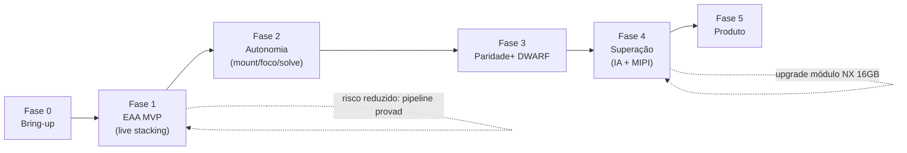

# 04 — Roadmap Faseado

Cada fase tem **entregável concreto** e **critério de saída** (o que precisa funcionar para avançar).
A filosofia: cada fase entrega algo *usável* e reduz um risco. Nunca "big bang".

---

## Fase 0 — Bring-up & ambiente (bancada)

**Objetivo:** Jetson pronta, GPU stack verificado, câmera dando frame.

- Flash JetPack 6.2.x; `nvpmodel` no modo de máxima performance; `jetson_clocks`.
- Compilar OpenCV com CUDA; instalar CuPy; validar `cv2.cuda.getCudaEnabledDeviceCount() > 0`.
- Instalar INDI + `indi-asi`; ligar a **ASI585MC** por USB3; capturar 1 frame RAW.
- SSD NVMe montado; índices ASTAP instalados.

**Critério de saída:** um script Python captura um frame da câmera, faz debayer na GPU (`cv2.cuda`) e
salva um PNG. Latência de captura→GPU medida.

---

## Fase 1 — EAA MVP (o coração do pipeline)

**Objetivo:** *live stacking* funcionando, visível ao vivo. Sem montagem ainda (tripé fixo ou manual).

- `capture/` → ring buffer em memória unificada.
- `gpu/`: debayer → portão de qualidade (FWHM + laplaciano) → registro (afim+RANSAC) → warp → `LiveStacker`.
- `server/websocket_stream.py`: transmite o acumulador (com *auto-stretch*) para uma UI web simples.
- Calibração básica: subtração de *master dark*.

**Critério de saída:** apontando manualmente para um campo estelar, o stack ao vivo **melhora visivelmente
o SNR** ao longo de 2–5 min, com frames ruins sendo rejeitados (contador de aceitos/rejeitados na UI).
Este é o momento em que **já superamos conceitualmente** o miolo do DWARF — em float32 e com métrica de qualidade.

---

## Fase 2 — Autonomia (montagem, foco, apontamento)

**Objetivo:** o telescópio se aponta, foca e centraliza sozinho.

- Integrar **ZWO AM3N** via `indi_lx200am5`: GOTO, tracking sideral, sincronização.
- **Plate solving ASTAP** assíncrono: alinhamento inicial + GOTO centrado + correção de deriva.
- **Autofoco** com curva hiperbólica de FWHM controlando o **ZWO EAF**.
- Máquina de estados da sessão (`core/orchestrator.py`): selecionar alvo → GOTO → solve → centrar → focar → empilhar.

**Critério de saída:** "vá para M31" na UI resulta, sem intervenção, em Andrômeda centralizada, focada e
empilhando ao vivo.

---

## Fase 3 — Paridade + com o DWARF 3

**Objetivo:** ter tudo que o DWARF faz, feito melhor.

- **Lucky imaging** completo (ponderação fina por FWHM; modo planetário/lunar com ROI + alto FPS).
- **Mosaico** automático (para M31 em focais mais longas; panorama).
- Suporte a **filtros** (L-Pro para galáxias, L-eXtreme para nebulosas em emissão) no fluxo.
- **Agendador** de sessões; calibração automática (darks/flats); *AI denoise* pós-stack.
- **Derotação de campo** robusta (modo EQ por software) validada.

**Critério de saída:** uma sessão noturna programada produz, sem operador, imagens integradas de múltiplos
alvos (galáxia + nebulosa + Lua) com qualidade comparável ou superior a exemplos do DWARF 3.

---

## Fase 4 — Superação (o que o DWARF não consegue)

**Objetivo:** usar a folga de 157 TOPS para o que SoCs de 5 TOPS não fazem.

- **Rastreamento IA em tempo real:** YOLOv8-TensorRT + fluxo óptico CUDA >60 FPS para ISS/satélites/meteoros,
  com correção **feed-forward** ao mount.
- **Caminho MIPI CSI zero-copy** (Arducam/Framos IMX585): latência mínima sensor→GPU, 60–90 FPS nativos.
- **Upgrade do módulo** para Orin NX 16GB (produção): stacking + IA + solve concorrentes.
- Streaming e controle abertos (INDI/WebSocket) para Stellarium/PHD2/apps de terceiros.

**Critério de saída:** o rig rastreia a ISS atravessando o campo mantendo-a centrada, enquanto continua a
empilhar — algo fora do alcance dos smart telescopes comerciais.

---

## Fase 5 — Produto (opcional, futuro)

**Objetivo:** sair da bancada para um dispositivo de campo.

- Gabinete selado (IP54+), gestão térmica ativa, anti-orvalho.
- Energia por bateria LiFePO4; gestão de energia (`nvpmodel` dinâmico).
- Integração mecânica (all-in-one estilo DWARF, ou "brain box" + óptica destacável).
- UX de campo (app móvel sobre a API WebSocket/REST).

---

## Linha do tempo lógica (dependências)

> **Marco decisivo é o fim da Fase 1:** com o *live stacking* em float32 + portão de qualidade funcionando,
> o risco técnico central do projeto está eliminado. Tudo depois é integração e otimização.
