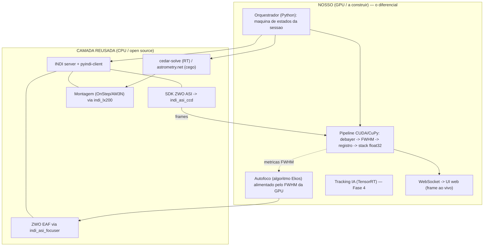

# 08 — Reusar vs. Construir (o mapa de decisão)

Resultado de 4 levantamentos de estado-da-arte (2026-07). A conclusão bate nos quatro:
**a maior parte de um smart telescope autônomo já existe pronta e madura em open source.**
O nosso trabalho de verdade — o que **ninguém** entrega hoje — é o **pipeline de GPU** (CUDA/CuPy/TensorRT).
Não reinventar montagem, foco, plate solving nem controle de hardware.

---

## 1. Princípio

> **Reusar toda a camada de controle/apontamento. Construir só o pipeline de GPU (o diferencial).**

Um smart telescope tem duas metades:

| Metade | Estado da arte | Nossa decisão |
|---|---|---|
| **Controle** (falar com hardware, apontar, focar, guiar, agendar) | **Resolvido** — INDI + Ekos + StellarSolver + PHD2 + OnStep + SDKs de câmera | **REUSAR** |
| **Processamento de imagem em GPU** (stacking float32, FWHM/lucky imaging, tracking IA em tempo real) | **Lacuna** — não existe live stacker em CUDA para Jetson | **CONSTRUIR** (é a nossa vantagem sobre o DWARF) |

Isso encolhe drasticamente o que precisamos escrever e elimina os maiores riscos (mecânica, solver, drivers).

---

## 2. Como o telescópio aponta — e por que reusamos o solver

Plate solving (descobrir para onde a câmera aponta) **não é pesado**: é **busca por hash**, não força bruta.
A indexação de milhões de padrões de estrelas é feita **uma vez, offline**, e vira um arquivo estático; em
tempo real são só algumas consultas → resolve em **milissegundos**, sem GPU, sem rede neural. É assim que o
DWARF aponta com um SoC fraco (mesma ideia dos *star trackers* de satélite).

**Loop de apontamento (que o Ekos/INDI já implementam):** slew → captura → *solve* → calcula erro → corrige → repete até centralizar. Rastreio altaz = taxa em malha aberta + **de-rotação de campo no stacker** + re-*solve* a cada ~30–60s.

**Solvers a reusar (rodam na CPU, deixam a GPU livre):**

| Engine | Algoritmo | Tempo (embarcado) | Licença | Papel |
|---|---|---|---|---|
| **cedar-detect + cedar-solve** (deriv. Tetra3/ESA) | padrão de 4 estrelas → tabela hash | ~12ms (Pi 5) → **10Hz+ na Jetson** | Apache-2.0 | ✅ Solver de **tempo real** (GOTO, re-centragem). Tem servidor gRPC |
| **astrometry.net** local | quad → kd-tree + verificação | <1s com dica | BSD/GPL | ✅ *Fallback* cego robusto (primeiro apontamento) |
| **ASTAP** (`astap_cli`) | quad "5 ratios" | ~0,5–2s | MPL-2.0 | ✅ Alternativa turnkey aarch64; também empilha offline |
| **StellarSolver** | embute o astrometry.net como **biblioteca C++** | ~astrometry.net | GPL-2.0+ | ✅ Se rodarmos via Ekos/INDI |

> **Não vamos escrever matcher de estrelas.** É problema resolvido; caseiro sai pior.

---

## 3. Catálogo — o que REUSAR

| Camada | Reusar | Licença | Jetson/ARM | Como usamos |
|---|---|---|---|---|
| Abstração de hardware | **INDI + `pyindi-client`** | LGPL-2.1 | ✅ nativo | Falar com câmera/montagem/foco a partir do Python |
| Plate solving | **cedar-solve** (RT) + **astrometry.net/ASTAP** (cego) | Apache/BSD/MPL | ✅ | GOTO, centragem, recuperação — **fora da GPU** |
| Firmware de montagem | **OnStep / OnStepX** (se montagem custom) | GPL | MCU | Geração de passos em tempo real no MCU, comandado por INDI/LX200 |
| Câmera USB3 | **SDK ZWO ASI** (aarch64) + `indi_asi_ccd` | grátis (fechado) | ✅ | Captura da ASI585MC sem bring-up |
| Guiagem | **PHD2** (JSON-RPC 4400) — *opcional* | BSD-3 | ✅ | Só quando quisermos subs longos; EAA de subs curtos dispensa |
| Foco (hardware) | `indi_asi_focuser` (ZWO EAF) | — | ✅ | Driver do motor de foco |
| Foco (algoritmo) | **Algoritmo do Ekos**: hipérbole/parábola + GSL Levenberg–Marquardt + gate R²/Peirce | GPL (doc pública) | — | Nossa curva de autofoco, alimentada pelo **nosso FWHM na GPU** |
| Calibração offline | **astropy + ccdproc** | BSD | ✅ | Master dark/flat/bias |
| Registro (bootstrap/validação) | **astroalign + sep** (triângulos + extração de fontes) | MIT/LGPL | ✅ (CPU) | Estabelecer o frame de referência e revalidar quando derivar |
| Re-stack de alta qualidade (offline) | **Siril headless** (`siril-cli`, pysiril) | GPL | ✅ build | Re-empilhar a sessão em qualidade máxima, SPCC, extração de fundo |
| Finalização por IA (no frame integrado) | **GraXpert** (ONNX→TensorRT), StarNet v1 | GPL | ✅ | Remoção de gradiente + denoise — **nunca por sub** |
| Orquestração de referência | **Ekos/StellarMate/Astroberry** como *template* de arquitetura | GPL | ✅ | Blueprint do scheduler/UX |

---

## 4. O que CONSTRUIR (nosso diferencial — nada open cobre no Jetson)

1. **O pipeline de GPU em tempo real** (o coração):
   debayer CUDA → calibração → detecção de estrela-guia → warp vs. **frame de referência travado** →
   **acumulador ponderado float32 na VRAM** → **rejeição por FWHM/Var. Laplaciana (lucky imaging)** na GPU.
   *Nenhum projeto astro faz live stacking em CUDA na Jetson — esta é a vantagem sobre o DWARF.*
   (É exatamente o código que já iniciamos em `src/gpu/` — validado pela pesquisa como a lacuna certa a preencher.)
2. **O caminho de captura MIPI CSI IMX585** (Fase 2): driver/device-tree + Argus/V4L2, zero-copy para CUDA.
   (Contornável na Fase 1 usando a câmera **USB3** + SDK ZWO.)
3. **O orquestrador fino** que costura o pipeline de GPU ao INDI (via `pyindi-client`) + cedar-solve + autofoco.
   Mantê-lo leve, em vez de adotar todo o Ekos.
4. **Rastreamento IA** (Fase 4): YOLOv8-TensorRT + fluxo óptico CUDA >60 FPS, correção feed-forward. (Só chega
   com o upgrade para o módulo Orin NX, que tem DLA para descarregar a inferência.)

---

## 5. Arquitetura de software revisada

---

## 6. C++ vs Python — decisão

**Python-first híbrido.** O trabalho pesado já é C++/CUDA compilado por baixo (OpenCV-CUDA, CuPy, TensorRT),
então orquestrar em Python **não custa velocidade de GPU**.

| Componente | Linguagem | Motivo |
|---|---|---|
| Pipeline de stacking (CuPy/OpenCV-CUDA) | **Python** | Trabalho roda na GPU; custo de chamada é desprezível se o dado fica na VRAM |
| Orquestração, plate solve, autofoco, INDI, WebSocket, UI | **Python** | Não é tempo real; velocidade de iteração importa |
| Captura MIPI CSI (exposição/ganho por frame) | **C++ (libargus)** | Menor latência, determinístico; API Python não controla tudo |
| Laço de motor/guiagem sub-ms | **C++** | Sem GIL, sem jitter de GC (`SCHED_FIFO`) |

**Migração:** protótipo tudo em Python → perfila → move para C++ **só** a captura Argus e o laço de controle
(onde o GIL/jitter mordem). Ponte via **pybind11** ou memória compartilhada/ZeroMQ.

---

## 7. Bônus — SDKs dos smart scopes comerciais (referência e interop)

SDKs de controle (engenharia reversa/abertos) que servem como **referência de API** e até para **controlar um
DWARF/Seestar real** a partir do nosso software:

- **ZWO Seestar:** `seestar_alp` (Alpaca HTTP/JSON), `seestarpy`, `pyindi_seestar`. Protocolo: JSON sobre TCP.
- **DWARFLAB DWARF II/3:** `dwarf_python_api` (WebSocket + protobuf) — expõe goto, autofoco, calibração,
  câmera; ecossistema `astro_dwarf_session`, `dwarfium`, `dwarfAlp`. DWARF 3 também fala HTTP/JSON, RTSP, BLE.

Ótimo para entender como um produto que shippa estrutura seu conjunto de comandos.

---

## 7.1 Custo: tudo grátis (restrição do projeto — nada pago)

Restrição firme: **nenhum software pago.** Todo o stack escolhido é **$0**. Buckets:

- ✅ **Open source completo:** INDI, Ekos, StellarSolver, cedar-solve/tetra3, astrometry.net, ASTAP,
  PHD2, OnStep/OpenAstro, astroalign/sep/photutils/astropy/ccdproc, CuPy, OpenCV, Siril, GraXpert,
  jetson-utils, dwarf_python_api, seestar_alp.
- 🆓 **Grátis, binário fechado ($0):** NVIDIA CUDA/TensorRT/VPI/JetPack (plataforma Jetson);
  SDK da câmera ZWO ASI / Player One (alternativa 100% aberta: V4L2/libcamera).
- 💰 **Pago — EVITAR (não entram no plano):** StellarMate OS → usar Astroberry/próprio; RC-Astro
  (BlurX/StarX/NoiseXTerminator) → usar GraXpert + StarNet v1; PixInsight/Voyager → não usar.
  Atenção: **StarNet v2** é grátis mas de redistribuição restrita → preferir **StarNet v1** (open).

**Nota de comercialização (só se um dia vender):** componentes permissivos (LGPL/Apache/MIT/BSD/MPL)
podem ser embutidos em produto fechado; os **GPL** (Siril, GraXpert, Ekos, distribuição do astrometry.net)
exigem abrir o fonte de derivados distribuídos. Para desenvolver/usar, tudo é livre sempre.

## 8. Como isso muda o roadmap

O [`docs/04-roadmap.md`](04-roadmap.md) continua válido, mas com **muito menos código nosso**:

- **Fase 1 (EAA MVP):** captura via **SDK ZWO + INDI** (não construir captura). Construir **só** o inner loop
  CUDA (stacker/FWHM/registro). Bootstrap do registro com **astroalign/sep**. → é o que já começamos em `src/`.
- **Fase 2 (autonomia):** **reusar** cedar-solve/ASTAP (plate solve) e o **algoritmo de autofoco do Ekos**;
  montagem via INDI. Zero solver caseiro.
- **Fase 3 (paridade+):** **reusar** Siril headless (re-stack offline) e **GraXpert** (denoise IA). Construir
  o modo planetário/mosaico.
- **Fase 4 (superação):** construir o **tracking IA** (TensorRT) — o que nenhum smart scope faz — e o caminho
  **MIPI CSI**. Upgrade para módulo Orin NX (DLA).

**Decisão arquitetural precoce:** (A) envelopar o INDI a partir do Python (`pyindi-client`) e ter nosso próprio
laço de controle — **máxima flexibilidade** para a integração CUDA (recomendado, casa com o objetivo de superar
o DWARF em processamento); ou (B) rodar Ekos headless via DBus e tratar nosso pipeline como add-on — caminho
mais rápido para um scope autônomo, mas carrega a dependência Qt/KDE inteira na Jetson. **Recomendo (A).**

---

## Fontes
Consolidadas dos 4 levantamentos — ver principais:
- Plate solving: astrometry.net (Lang et al. 2010), ESA tetra3, cedar-solve/cedar-detect (smroid), ASTAP (hnsky.org).
- Controle: INDI (indilib), Ekos/KStars (kstars-docs — Focus/Align/Scheduler), StellarSolver, PHD2, OnStep, SDK ZWO ASI.
- Stacking/libs: Siril (siril.readthedocs.io), astroalign (MIT), sep, photutils, GraXpert, CuPy.
- Jetson/SDKs: VPI, DeepStream, Holoscan, Isaac ROS, jetson-utils (dusty-nv), libargus.
- Interop: seestar_alp, dwarf_python_api.
