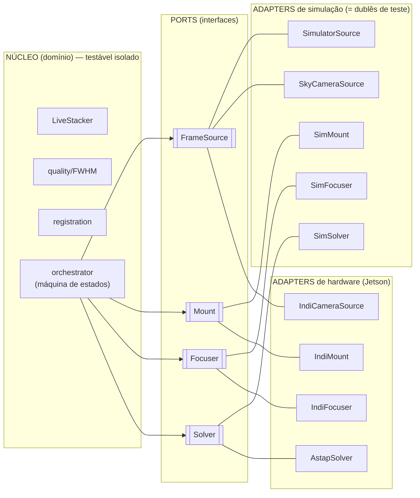

# 10 — Arquitetura Testável & Estratégia de Testes

**Premissa do projeto (não-negociável):** toda implementação nasce com testes e segue uma
arquitetura testável. Não é firmware "que funciona numa rodada" — é software robusto, com
padrões de projeto e testes automatizados, rodando leve na Jetson.

---

## 1. Arquitetura: Ports & Adapters (Hexagonal)

Escolhida porque casa perfeitamente com **hardware abstrato + testabilidade**: os adapters
simulados (`Sim*`) **são os próprios dublês de teste**, então o sistema inteiro roda e é testado
**sem hardware e sem GPU**.



> Trocar `Sim*` por `Indi*/Astap*` no bring-up **não altera o núcleo nem os testes**.

## 2. Padrões de projeto em uso (já aplicados no código)

| Padrão | Onde | Para quê |
|---|---|---|
| **Strategy** | `backend.xp` (CuPy vs NumPy) | mesmo código roda em GPU ou CPU |
| **Adapter** | `Sim*` / `Indi*` sobre os ports | isolar o hardware |
| **Factory** | `capture.source.build_source()` | criar a fonte por configuração |
| **Dependency Injection** | `Session(source=…, mount=…, solver=…)` | injetar dublês nos testes |
| **State machine** | `orchestrator` (find→focus→stack) | fluxo autônomo explícito |
| **Null Object** | `Calibrator` sem dark = identidade | evitar `if` espalhado |

## 3. Estratégia de testes: a Pirâmide

```
        ▲  E2E (poucos):     sequência autônoma via Sim* (auto_find→autofocus→run_stack)
       ▲▲  Integração:       pipeline por adapters simulados (Session, SkyCamera)
     ▲▲▲▲  Unit (muitos):    funções puras/numéricas (stacker, FWHM, registro, autofoco)
```

- **Unit** — rápidos, determinísticos (seeds fixas), tolerâncias numéricas generosas.
- **Integração** — o `Session` inteiro com `Sim*`; prova a fiação sem hardware.
- **Contract tests** — todo `FrameSource` devolve `(ndarray, dict)`; garante que qualquer
  adapter (sim ou real) cumpre o contrato do port. (Ver `tests/test_integration.py`.)
- **Regressão = TDD pontual** — bug vira teste que falha primeiro, depois o fix (ex.: o FWHM
  que rejeitava frames bons virou `test_fwhm_matches_known_sigma`).

**Metodologia adotada:** pragmática — *test-alongside* para algoritmos, *TDD* para correções e
contratos. **DDD foi descartado** (é para domínios de negócio complexos; nosso domínio é numérico/
de dispositivos, onde Hexagonal + pirâmide entregam mais com menos cerimônia).

## 4. Por que roda bem na Jetson

- Toda a suíte usa o **`backend`**: no CI/PC roda em **NumPy**, na Jetson em **CuPy** — **os mesmos
  testes**, sem reescrever. Nada exige GPU ou hardware.
- **Markers** separam o que é especial: `pytest -m "not hardware"` (padrão do CI) pula testes de
  hardware; `@pytest.mark.gpu` marca os que só fazem sentido com CUDA.
- Suíte **rápida** (~5s), para rodar a cada commit sem atrito.

## 5. Ferramentas

| Linguagem | Framework | Build/runner |
|---|---|---|
| **Python** | `pytest` (+ `pytest-cov`) | `pytest` |
| **C++** (hot path) | **doctest** (header-only, leve) | **CMake + CTest** |

C++ usa doctest por ser mínimo e rápido (compila em ms, ideal p/ Jetson) — vs GoogleTest (mais
pesado). Runtime estático no MinGW (`-static`) → exe autocontido.

## 6. Como rodar

```bash
# Python (na raiz do projeto)
pytest                       # toda a suíte
pytest -m "not hardware"     # o que o CI roda
pytest --cov=src             # com cobertura

# C++
cmake -S cpp -B cpp/build -G Ninja
cmake --build cpp/build
ctest --test-dir cpp/build --output-on-failure
```

## 7. Convenções (a "premissa" para cada nova implementação)

1. **Um módulo de teste por módulo de código** (`tests/test_<x>.py`).
2. **AAA** (Arrange–Act–Assert), nomes descritivos, **seeds fixas** (determinismo).
3. Testar **comportamento pelos ports**, não a implementação (troca CuPy↔NumPy / astroalign↔cv2
   sem quebrar teste).
4. **Nenhum teste** no CI depende de GPU, hardware ou rede.
5. Novo hardware → um `Adapter` + o **contract test** já cobre o contrato.
6. Bug → **teste que falha primeiro**, depois o fix.

## 8. Status atual (2026-07)
- **Python: 36 testes** verdes em ~5s (backend, stacker, quality/FWHM, registro, calibração,
  controle, céu, imageio, integração/contrato).
- **C++: 5 casos doctest** verdes (control_math: erro de apontamento, saturação, passo de correção,
  vértice de parábola do autofoco).

## 9. Próximo (opcional): CI
`.github/workflows/ci.yml` rodando `pytest -m "not hardware"` + o build/ctest do C++ a cada push —
um passo natural quando o projeto virar repositório git.
