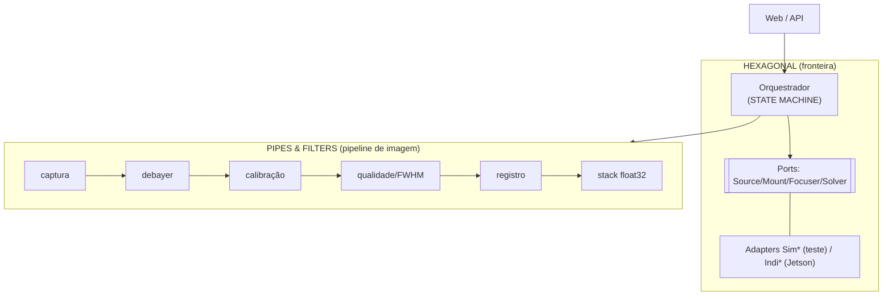

# 11 — Qual arquitetura para o nosso projeto (a decisão)

Suas sugestões (TDD, DDD) foram úteis para **separarmos os conceitos** — que é o primeiro passo
para escolher certo. A conclusão honesta abaixo.

## Primeiro: TDD e DDD não são a mesma categoria

| Sigla | O que é | Para nós |
|---|---|---|
| **TDD** | *Processo* (teste antes → red/green/refactor). **Não é arquitetura.** | ✅ **Sim, pontual** — em bugs e contratos |
| **DDD** | *Arquitetura* de domínio (entidades, agregados, bounded contexts) | ⚠️ **Só um pedaço** (value objects) |
| **Hexagonal, Pipes&Filters, State Machine…** | *Arquiteturas* | ✅ **A base** |

## A escolha: uma COMPOSIÇÃO (porque o sistema tem duas naturezas)

Nosso software é metade **fluxo de dados** (pipeline de imagem) e metade **controle de dispositivos**
(hardware + autonomia). Nenhuma arquitetura única serve às duas — então compomos:

| Camada | Arquitetura | Estado |
|---|---|---|
| Fronteira com hardware / IO / UI | **Ports & Adapters (Hexagonal)** | ✅ em uso (`FrameSource/Mount/Focuser/Solver` + `Sim*`/`Indi*`) |
| Pipeline de imagem (captura→debayer→FWHM→registro→stack) | **Pipes & Filters** | ◑ implícito (estágios já isolados/testáveis) |
| Autonomia (find→focus→stack, loop, erro) | **State Machine explícita** | ✅ implementada (`core/state.py`) |
| Modelagem de conceitos | **Value Objects (DDD tático)** — leve | ○ a adotar onde clarear (`Pointing`, `FWHM`) |
| Processo de trabalho | **TDD pontual** + pirâmide de testes | ✅ em uso |

### Por que Hexagonal é a espinha dorsal
O objetivo do projeto é literalmente *"desenvolver com simulador, implantar com hardware"*. Ports &
Adapters entrega isso: os adapters `Sim*` **são os dublês de teste**, então o sistema roda e é testado
sem GPU/câmera. Trocar por `Indi*/Astap*` no bring-up **não muda o núcleo nem os testes**.

### Por que Pipes & Filters no pipeline
O pipeline é dataflow puro: cada estágio (debayer, calibração, qualidade, registro, stack) é um *filtro*
com entrada→saída bem definida. Isso mapeia direto para **CUDA streams** e deixa cada estágio testável e
reordenável em isolamento. (Já testamos cada um separadamente.)

### Por que State Machine na autonomia
Robustez: estados nomeados (IDLE/SLEWING/SOLVING/FOCUSING/STACKING/ERROR/STOPPED) com **transições
válidas** e um invariante de segurança — *não se empilha direto após um slew cego* (SLEWING→STACKING é
proibido; tem que passar por SOLVING). STOPPED é terminal; ERROR é recuperável. Tudo testado
(`tests/test_state.py`).

### Por que NÃO DDD completo
Bounded contexts, agregados e repositórios domam complexidade de **negócio** (pedidos, faturas,
usuários). Nosso domínio é **numérico e de dispositivos** — DDD completo seria cerimônia sem retorno.
Mas o pedaço tático **value objects** (tipos pequenos e imutáveis para conceitos do domínio) vale a pena
e entra quando clarear o código.

## Diagrama da composição

## O que muda na prática
- **Nada de reescrita** — é formalizar o que já existe e completar as lacunas (state machine ✅; value
  objects quando útil; pipeline como filtros explícitos se a extensibilidade pedir).
- **Premissa de testes** (docs/10) continua valendo para cada camada.

## Resumo em uma linha
> **Hexagonal (base) + Pipes&Filters (pipeline) + State Machine (autonomia) + Value Objects leves; TDD
> como processo pontual. DDD completo, não.**
