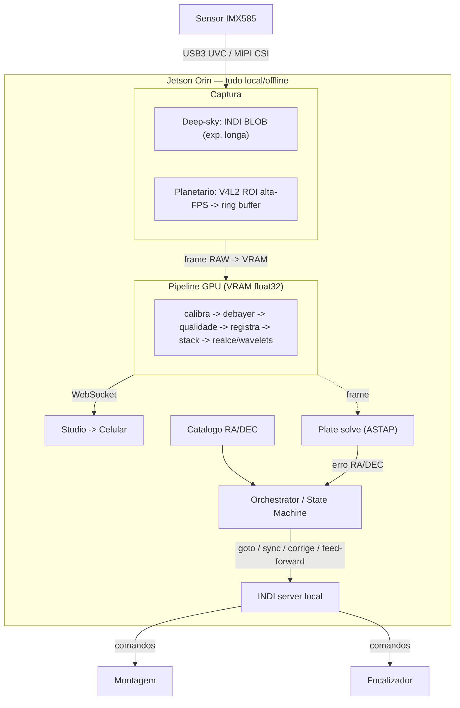

# 31 — Bring-up de câmera e controle na Jetson (Milestone F)

Como a imagem sai do **sensor** e chega à **GPU**, e como a Jetson **comanda a montagem/foco** para apontar
e seguir. Tudo **local/offline** (sem internet, sem PC em campo). É o Entregável 1 do CLAUDE.md (fluxograma
sensor→VRAM→saída, minimizando cópias Host↔Device). Hoje tudo isto roda com **simuladores**; aqui está o
plano para trocar pelos periféricos reais sem reescrever o pipeline (graças aos Ports & Adapters).

## Duas trilhas independentes

### A) Ingestão de imagem — sensor → GPU

Dois caminhos físicos (começamos no mais simples):

1. **USB3 (bring-up primeiro)** — a câmera que compraremos (ASI585 / Svbony SV705, ambas **IMX585**) fala USB3.
   - **Deep-sky:** `INDI` (`indi_asi_ccd` ou UVC) → BLOB → RAM → GPU. Exposições de segundos, poucos FPS →
     latência por-frame não importa. Já temos `IndiCameraSource`.
   - **Planetário:** `V4L2` mmap direto (ROI pequena, **100–200+ FPS**) → `ring_buffer` → GPU. O BLOB do INDI
     é lento por-frame; para lucky imaging usa-se V4L2 cru. → **adapter novo** (`capture/v4l2_source.py`).

2. **MIPI CSI (otimização depois)** — o IMX585 numa placa CSI → `libargus`/`nvarguscamerasrc` → **NVMM
   zero-copy** → CUDA (EGLStream). Sem cópia CPU nenhuma. Exige driver L4T do IMX585 (alguns fornecedores dão).

**Regra de memória (CLAUDE.md):** manter o frame na **VRAM**; no Orin a LPDDR5 é **unificada** (CPU/GPU
compartilham), então "cópia" é barata — mas ainda usar buffers *pinned/managed* + `cudaMemcpyAsync` e não
descer para NumPy no meio do pipeline (o `xp`/CuPy já garante isso).

### B) Controle — Jetson → montagem/foco

- **INDI server local** expõe os periféricos: montagem (ZWO AM3/AM5 → `indi_lx200`/`eqmod` ou driver ZWO),
  focalizador (ZWO EAF → `indi_asi_focuser`), roda de filtros.
- `IndiMount` (goto/sync em RA/DEC), `IndiFocuser` (move_to), `IndiFilterWheel` — **prontos e testados**
  contra os simuladores INDI reais (docs/20, 28). Trocar o simulador pelo driver real é só configurar o INDI.

## O laço completo: apontar → capturar → seguir

Passo a passo (já implementado com simuladores):
1. **Escolhe alvo** no catálogo (`core/catalog` → RA/DEC).
2. **GOTO:** `mount.goto(RA,DEC)` → INDI → a montagem faz o slew.
3. **Centralização em malha fechada (T16):** expõe → **plate-solve** (ASTAP) → calcula o erro → `sync`/corrige
   → repete (~2 iters) até centralizar. É o "apontar sozinho".
4. **Autofoco:** varredura do focalizador medindo **FWHM** → zona de foco crítico (curva-V).
5. **Captura** (dois modos):
   - **Deep-sky:** `[expõe → calibra → debayer → gate FWHM/lucky → registra → stack em VRAM]` + dither +
     correção de tracking periódica (re-solve).
   - **Planetário:** `[ROI alta-FPS → ring buffer → grade → seleciona → alinha (correlação de fase) → stack →
     wavelets]` → **mosaico** de vários painéis para a Lua (módulo `core/mosaic` já existe).
6. **Live view:** o stack vai para o `studio` (WebSocket) → **celular**.
7. Tudo orquestrado pela **State Machine** (`core/state`); nada sai da Jetson.

## Reuso vs. construir

| Já pronto (reuso) | Novo (Milestone F) |
|---|---|
| Adapters INDI (câmera/mount/foco/roda) | Adapter **V4L2 alta-FPS** p/ planetário (ROI) |
| Pipeline GPU (calib/debayer/quality/registra/stack) | Driver real da câmera no Orin (`indi_asi_ccd`/V4L2) |
| Laço auto-find (goto→solve→sync) + autofoco | Driver real da montagem/foco (config INDI) |
| Plate solve (ASTAP), catálogo, studio, planetário | **C++ hot path** (libargus + laço motor sub-ms) — depois |
| State machine, orquestrador, ring buffer | **MIPI CSI** zero-copy (NVMM) — depois |

## Sequência (Milestone F)

- **F1 — Câmera USB3 no Orin.** Instalar SDK/driver (ASI SDK + `indi_asi_ccd`, ou V4L2 puro); confirmar
  frames RAW. Ligar `IndiCameraSource`. **Primeira compra** (câmera ainda não temos).
- **F2 — Adapter V4L2 alta-FPS** (ROI) → `ring_buffer` → pipeline planetário. Medir FPS real no Orin.
- **F3 — Montagem + focalizador reais** via INDI. Teste de GOTO físico.
- **F4 — Malha fechada real:** goto→solve→centraliza movendo a montagem de verdade.
- **F5 — Caracterização térmica/FPS** sob carga real (decide 8GB vs Orin NX 16GB).
- **F6 — C++ hot path** (libargus + motor sub-ms) + **MIPI CSI** zero-copy.

## Decisões em aberto

- **Câmera:** ASI585 (SDK maduro + INDI robusto) vs **Svbony SV705** (mais barata; validar suporte INDI/UVC
  no aarch64 antes). Ambas IMX585 → o pipeline é o mesmo.
- **Montagem:** ZWO AM3/AM5 (INDI pronto) vs OnStepX (DIY, mais barato). Precisa suportar goto+tracking.
- Sem câmera/montagem ainda → **F1/F3 dependem da compra**; o software está pronto para recebê-los (é só um
  Adapter por periférico, com import tardio do SDK e falha limpa sem hardware — o contract test já cobre).
